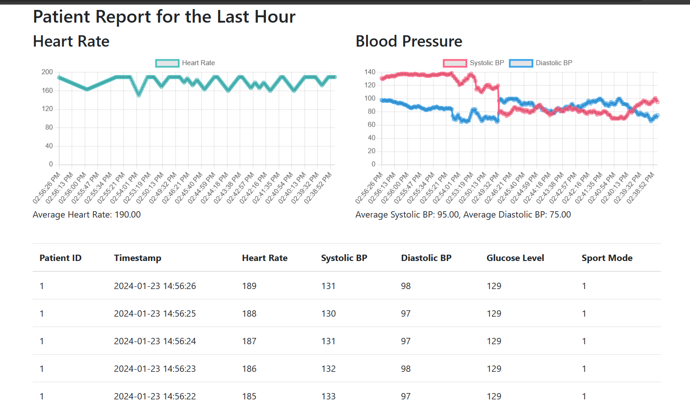
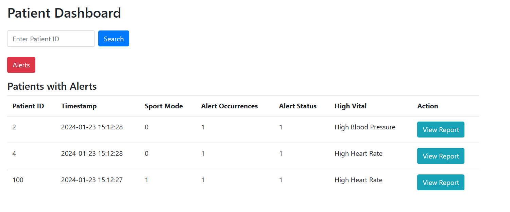

# Patient Health Monitoring System – IoT Data Processing

This project demonstrates an **IoT-based real-time patient health monitoring system**, developed using **Apache Kafka**, **Faust**, **PySpark**, and **MySQL**.  
It continuously collects, processes, and visualizes patient vitals, enabling proactive healthcare decisions through real-time analytics and alerting.

##  Project Overview
The system provides **continuous monitoring of patient health parameters** by streaming sensor data through a scalable, fault-tolerant data pipeline.  
It uses advanced **data ingestion, processing, and visualization** techniques to detect anomalies and notify healthcare providers of abnormal conditions.

## Dashboard Example




##  Objectives
- **Real-time Data Processing:** Stream and process patient vitals every second using Kafka and Faust.  
- **Scalable Architecture:** Handle large data volumes efficiently for multiple patients simultaneously.  
- **Accurate Monitoring:** Detect anomalies in vital parameters using data analysis algorithms.  
- **User-Friendly Visualization:** Provide a clean and accessible dashboard for medical staff.  
- **Reliable Storage:** Use MySQL for persistent and secure data storage.

##  System Architecture
**Core Components**
| Layer | Technology | Description |
|-------|-------------|-------------|
| Data Ingestion | **Apache Kafka** | Streams real-time patient vitals from IoT devices |
| Coordination | **Zookeeper** | Manages Kafka brokers and ensures reliability |
| Stream Processing | **Faust** / **PySpark** | Processes live data, calculates averages, detects anomalies |
| Database | **MySQL** | Stores patient health records and status |
| Backend | **Python** | Implements data pipeline and alert logic |
| Visualization | **Dashboard / Charts** | Displays live vitals and alert notifications |

##  Data Flow
1. **Data Ingestion:** Kafka receives continuous patient data from simulated IoT sensors (`patient-data` topic).  
2. **Stream Processing:** Faust / PySpark algorithms process each record in real time.  
3. **Alert Evaluation:** Data is analyzed to detect anomalies (e.g., abnormal temperature, pulse, SpO₂).  
4. **Database Storage:** Processed results and alerts are saved in MySQL.  
5. **Visualization:** Live dashboards show patient status and health trends.

##  Key Technologies
| Category | Tools |
|-----------|-------|
| Language | Python |
| Stream Platform | Apache Kafka, Faust |
| Coordination | Zookeeper |
| Data Processing | PySpark |
| Database | MySQL |
| Visualization | Python Charts / Web Dashboard |

##  System Performance
- Designed to process **1,000+ patient records per second** in real time.  
- Demonstrated smooth throughput up to **1k events/sec**, with optimization planned for distributed scaling.  
- Performance benchmark: process each batch within **1 second** for live anomaly detection.

##  How to Run
1. **Start Kafka and Zookeeper**
   ```bash
   zookeeper-server-start.sh config/zookeeper.properties
   kafka-server-start.sh config/server.properties
   ```
2. **Create Kafka topic**
   ```bash
   kafka-topics.sh --create --topic patient-data --bootstrap-server localhost:9092
   ```
3. **Run the Python data producer**
   ```bash
   python producer.py
   ```
4. **Run the stream processor (Faust or PySpark)**
   ```bash
   python consumer_faust.py
   # or
   spark-submit streaming_job.py
   ```
5. **Launch the dashboard**
   ```bash
   python dashboard.py
   ```


## Future Enhancements
- **Scalability:** Kafka cluster scaling and distributed Faust consumers  
- **Database Optimization:** Sharded MySQL for large-scale deployment  
- **Custom Alerts:** Configurable patient-specific thresholds  
- **Patient Engagement:** Mobile interface integration for doctors and patients  

##  Learning Outcomes
- Gained practical experience with **real-time streaming and distributed processing**.  
- Implemented an **end-to-end IoT data pipeline** with Kafka and Faust.  
- Enhanced understanding of **scalable database and alert systems** in healthcare.  
- Strengthened skills in **Python-based data engineering** and system performance tuning.

##  Authors
**Deepak Madhu**
University of Applied Sciences Emden/Leer  
Course: IoT Data Processing & Real-Time Systems

## License
For educational and demonstration purposes.
